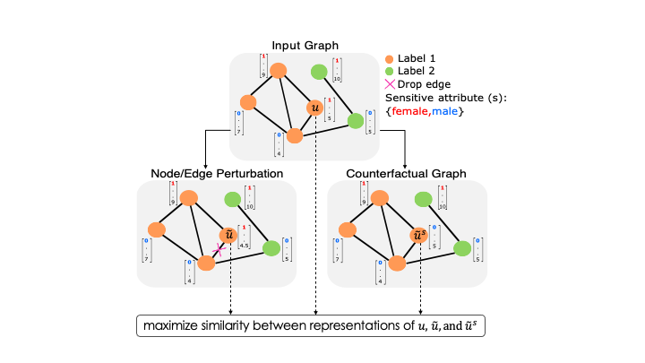

## Towards a Unified Framework for Fair and Stable Graph Representation Learning

This repository contains source code necessary to reproduce some of the main results in [the paper](https://arxiv.org/abs/2102.13186):

**If you use this software, please consider citing:**
    
    @article{agarwal2021unified,
      title={Towards a Unified Framework for Fair and Stable Graph Representation Learning},
      author={Chirag Agarwal and Himabindu Lakkaraju* and Marinka Zitnik*},
      year={2021},
      booktitle={arXiv},
    }

    

<i>
  Our framework NIFTY can learn node representations that are both fair and stable (i.e., invariant to the sensitive attribute value and perturbations to the graph   structure and non-sensitive attributes) by maximizing the similarity between representations from diverse augmented graphs.  
</i>

## 1. Setup

### Installing software
This repository is built using PyTorch. You can install the necessary libraries by pip installing the requirements text file `pip install -r ./requirements.txt`
After installing the packages from the requirements.txt, install the PyTorch Geometric packages following the instructions from [here.](https://pytorch-geometric.readthedocs.io/en/latest/notes/installation.html)

**Note:** We ran our codes using python=3.7.9

## 2. Datasets
We ran our experiments on three high-stake read-world datasets. All the data are present in the './datasets' folder. Due to space constraints the edge file of the credit dataset is zipped.

## 3. Usage
The main scripts running the experiments on the state-of-the-art GNNs and their NIFTY-augmented counterparts is in [nifty_sota_gnn.py](nifty_sota_gnn.py)

### Examples
Script 1: Evaluate fairness and stability performance of GCN (for German Graph dataset)
`python nifty_sota_gnn.py --dropout 0.5 --hidden 16 --lr 1e-3 --epochs 1000 --model gcn --dataset german --seed 1`

<i>
  The AUCROC of estimator: 0.7605 
  Parity: 0.3952 | Equality: 0.2731 
  F1-score: 0.8078 
  CounterFactual Fairness: 0.2960 
  Robustness Score: 0.1160 
</i>

Script 2: Evaluate fairness and stability performance of NIFTY-GCN (for German Graph dataset)
`python nifty_sota_gnn.py --drop_edge_rate_1 0.001 --drop_edge_rate_2 0.001 --drop_feature_rate_1 0.1 --drop_feature_rate_2 0.1 --dropout 0.5 --hidden 16 --lr 1e-3 --epochs 1000 --model ssf --encoder gcn --dataset german --sim_coeff 0.6 --seed 1`

<i>
  The AUCROC of estimator: 0.7205 
  Parity: 0.0104 | Equality: 0.0199 
  F1-score: 0.8235 
  CounterFactual Fairness: 0.0 
  Robustness Score: 0.0 
</i>
  

Script 3: Evaluate fairness and stability performance of FairGCN baseline (for German Graph dataset)
`python baseline_fairGNN.py --dropout 0.5 --hidden 16 --lr 1e-3 --epochs 1000 --dataset german --seed 1 --model gcn`

<i>
  The AUCROC of estimator: 0.7549 
  Parity: 0.2763 | Equality: 0.1723 
  F1-score: 0.8251 
  CounterFactual Fairness: N/A 
  Robustness Score: 0.0440 
</i>
   

Script 4: Evaluate fairness and stability performance of RobustGCN (for German Graph dataset)
`python nifty_sota_gnn.py --dropout 0.5 --hidden 16 --lr 1e-3 --epochs 1000 --model rogcn --dataset german --seed 5`

<i>
  The AUCROC of estimator: 0.6230 
  Parity: 0.2449 | Equality: 0.2048 
  F1-score: 0.6143 
  CounterFactual Fairness: 0.0880 
  Robustness Score: 0.1320 
</i>
  

## 4. Licenses
Note that the code in this repository is licensed under MIT License. Please carefully check them before use. 

## 5. Questions?
If you have questions/suggestions, please feel free to [email](mailto:chiragagarwall12@gmail.com) or create github issues.
